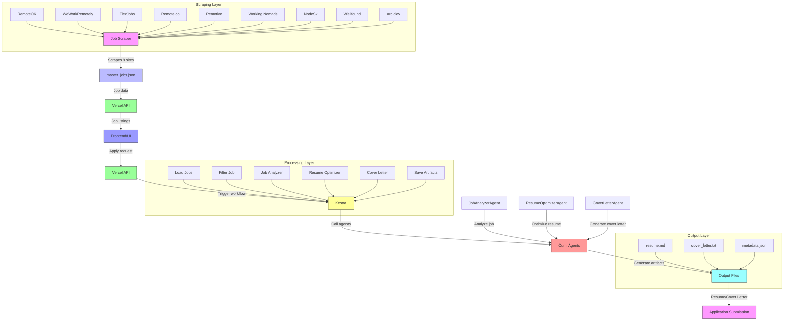
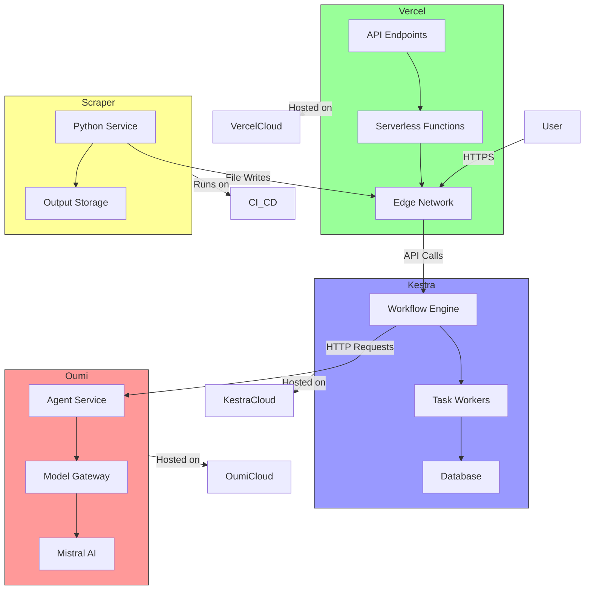

# AI Job Hunter - System Architecture

## 🏗️ Overview

The AI Job Hunter system is a multi-component, AI-powered job application automation platform. This document describes the complete architecture, data flow, and integration points.

## 📊 System Components



## 🔧 Technical Architecture

### 1. Scraping Layer

**Component**: `scrapers/job_scraper.py`

**Responsibilities**:
- Web scraping from 9 job boards
- HTML parsing and data extraction
- Pagination handling
- Rate limiting and anti-blocking
- Data normalization

**Technologies**:
- Python 3.11+
- BeautifulSoup (HTML parsing)
- Playwright (JS-heavy sites)
- Requests with retries
- Asyncio for concurrency

**Output**: `/outputs/master_jobs.json`

### 2. API Layer

**Component**: `vercel/api/*`

**Endpoints**:

| Endpoint | Method | Description | Parameters |
|----------|--------|-------------|------------|
| `/api/jobs` | GET | List available jobs | `role`, `remote`, `entry_level`, `limit`, `skip` |
| `/api/apply` | POST | Start application process | `job_id`, `candidate` |
| `/api/apply` | GET | Check application status | `execution_id` |

**Technologies**:
- Next.js API routes
- Vercel hosting
- Node.js 20+
- RESTful design

### 3. Workflow Layer

**Component**: `kestra/workflows/main.yaml`

**Workflow Steps**:

1. **Load Jobs**: Read from `/outputs/master_jobs.json`
2. **Select Job**: Filter by job_id
3. **Job Analysis**: Call Oumi JobAnalyzerAgent
4. **Resume Optimization**: Call Oumi ResumeOptimizerAgent
5. **Cover Letter Generation**: Call Oumi CoverLetterAgent
6. **Save Artifacts**: Write to structured output
7. **Completion**: Log and notify

**Technologies**:
- Kestra workflow engine
- YAML configuration
- HTTP tasks for agent calls
- Python scripts for file operations

### 4. AI Agents Layer

**Component**: `oumi/agents.yaml` + templates

**Agents**:

| Agent | Model | Input | Output |
|-------|-------|-------|--------|
| JobAnalyzerAgent | mistralai/devstral-2512:free | Job posting | Structured requirements analysis |
| ResumeOptimizerAgent | mistralai/devstral-2512:free | Job analysis + resume | Optimized resume + match score |
| CoverLetterAgent | mistralai/devstral-2512:free | Job + optimized resume | Tailored cover letter |

**Technologies**:
- Oumi multi-agent framework
- Mistral AI LLM
- Template-based prompting
- JSON schema validation

### 5. Output Layer

**Structure**: `/outputs/{job_slug}/{candidate_id}/`

**Files**:
- `resume.md`: Optimized resume in markdown
- `cover_letter.txt`: Generated cover letter
- `metadata.json`: Processing metadata

## 📦 Data Flow

```mermaid
%% Data Flow Diagram
flowchart LR
    %% Data Sources
    DS1[RemoteOK] -->|HTML| Scraper
    DS2[WeWorkRemotely] -->|HTML| Scraper
    DS3[FlexJobs] -->|API| Scraper

    %% Processing Pipeline
    Scraper -->|Raw Jobs| Normalizer
    Normalizer -->|Normalized Jobs| Filter
    Filter -->|Filtered Jobs| master_jobs.json

    %% Application Flow
    master_jobs.json -->|Job Data| API
    API -->|Job List| Frontend
    Frontend -->|Apply Request| API
    API -->|Workflow Trigger| Kestra

    %% Kestra Workflow
    Kestra -->|Job Data| JobAnalyzer
    JobAnalyzer -->|Analysis| ResumeOptimizer
    ResumeOptimizer -->|Optimized Resume| CoverLetterAgent
    CoverLetterAgent -->|Cover Letter| ArtifactSaver

    %% Output
    ArtifactSaver -->|Resume| OutputFiles
    ArtifactSaver -->|Cover Letter| OutputFiles
    ArtifactSaver -->|Metadata| OutputFiles

    %% Styling
    classDef source fill:#f96,stroke:#333;
    classDef process fill:#69f,stroke:#333;
    classDef storage fill:#9f6,stroke:#333;
    classDef output fill:#f69,stroke:#333;

    class DS1,DS2,DS3 source;
    class Scraper,Normalizer,Filter,API,Frontend,Kestra,JobAnalyzer,ResumeOptimizer,CoverLetterAgent,ArtifactSaver process;
    class master_jobs.json,OutputFiles storage;
```



## 🔗 Integration Points

### 1. Scraper → API

- **File**: `/outputs/master_jobs.json`
- **Format**: JSON array of job objects
- **Schema**: See sample in `outputs/master_jobs.json`

### 2. API → Kestra

- **Endpoint**: `POST https://{{KESTRA_URL}}/api/v1/executions`
- **Headers**: `Authorization: Bearer {{KESTRA_API_TOKEN}}`
- **Payload**: Workflow execution request

### 3. Kestra → Oumi Agents

- **Endpoint**: `POST {{OUMI_BASE_URL}}/agents/{agent_name}`
- **Headers**: `Authorization: Bearer {{OUMI_API_KEY}}`
- **Payload**: Agent-specific input data

### 4. Oumi Agents → Kestra

- **Response**: Structured JSON matching agent output schema
- **Validation**: JSON schema validation in workflow

## 🛡️ Security Architecture

### Secret Management

- **Placeholders**: All secrets use `{{KEY_NAME}}` placeholders
- **Environment Variables**: Real secrets loaded at runtime
- **Never in Code**: No API keys committed to repository

### API Security

- **Authentication**: Bearer tokens for all API calls
- **Input Validation**: Strict validation of all inputs
- **Rate Limiting**: 100 requests/minute on public endpoints
- **CORS**: Restricted to trusted domains

### Data Protection

- **At Rest**: Files stored with appropriate permissions
- **In Transit**: HTTPS for all external communications
- **Sensitive Data**: Candidate data handled with care

## 🚀 Deployment Architecture



## 📊 Performance Considerations

### Scraping Layer
- **Concurrency**: 3 parallel scrapers
- **Rate Limiting**: 1-2.5s between requests
- **Timeouts**: 30s per request
- **Retries**: 3 attempts with exponential backoff

### API Layer
- **Caching**: 5-minute cache on job listings
- **Response Size**: Limited to 10mb
- **Timeouts**: 10s for external calls

### Workflow Layer
- **Timeout**: 30 minutes total
- **Retries**: 3 attempts per HTTP task
- **Resource Limits**: 2 CPU, 2GB memory

### AI Agents
- **Temperature**: 0.3-0.7 for controlled creativity
- **Token Limits**: 1024-2048 tokens per call
- **Fallbacks**: Graceful degradation on failures

## 🔧 Configuration

### Environment Variables

```env
# Kestra
KESTRA_URL=https://your-kestra-instance.com
KESTRA_API_TOKEN={{KESTRA_API_TOKEN}}

# Oumi
OUMI_BASE_URL=https://your-oumi-instance.com
OUMI_API_KEY={{OUMI_API_KEY}}

# Mistral AI
MISTRAL_API_KEY={{MISTRAL_API_KEY}}

# Vercel
VERCEL_API_TOKEN={{VERCEL_API_TOKEN}}
```

### Runtime Parameters

| Parameter | Default | Description |
|-----------|---------|-------------|
| MAX_PAGES_PER_SITE | 5 | Maximum pages to scrape per site |
| REQUEST_DELAY | 2.0s | Delay between HTTP requests |
| MAX_RETRIES | 3 | Maximum retry attempts |
| CONCURRENT_SCRAPERS | 3 | Number of parallel scrapers |

## 📋 Error Handling Strategy

### Scraper Errors
- **Network Failures**: Retry with exponential backoff
- **Broken HTML**: Try alternate selectors, save snapshot
- **Empty Pages**: Skip and log
- **Rate Limiting**: Honor Retry-After headers

### API Errors
- **Validation Errors**: 400 responses with details
- **Authentication Errors**: 401/403 responses
- **Server Errors**: 500 responses with logging
- **Timeouts**: 504 responses

### Workflow Errors
- **Task Failures**: Retry 3 times, then fail workflow
- **Agent Failures**: Use fallback responses
- **File Errors**: Atomic writes with backups
- **Notifications**: Webhook on failure

## 🧪 Testing Strategy

### Unit Tests
- **Scraper**: Individual site scrapers
- **API**: Endpoint handlers
- **Workflow**: Task validation

### Integration Tests
- **Full Pipeline**: Scrape → Analyze → Optimize → Generate
- **Error Scenarios**: Network failures, invalid data
- **Performance**: Response times, throughput

### End-to-End Tests
- **User Journey**: Job search → Application → Completion
- **Data Flow**: Verify all integration points
- **Output Quality**: Validate generated artifacts

## 📈 Scaling Considerations

### Horizontal Scaling
- **Scrapers**: Add more worker instances
- **API**: Vercel auto-scales
- **Workflows**: Kestra worker scaling

### Vertical Scaling
- **Memory**: Increase for larger job datasets
- **CPU**: More cores for parallel processing
- **Storage**: Scalable cloud storage

### Cost Optimization
- **Caching**: Reduce duplicate scraping
- **Batching**: Process multiple jobs together
- **Spot Instances**: For non-critical workloads

## 🔮 Future Enhancements

1. **Additional Job Sites**: Expand to 15+ sources
2. **Advanced NLP**: Better skill extraction and matching
3. **Application Tracking**: Monitor application status
4. **Interview Preparation**: Generate interview questions
5. **Salary Negotiation**: AI-powered negotiation tips
6. **Multi-Language Support**: International job markets

## 📝 Changelog

**v1.0.0** (Hackathon Submission)
- Initial implementation
- 9 job sites supported
- 3 AI agents
- Complete workflow automation
- Full CI/CD pipeline

## 📚 References

- [Kestra Documentation](https://kestra.io/docs)
- [Oumi Framework](https://oumi.ai/docs)
- [Mistral AI Models](https://mistral.ai/technology/)
- [Vercel API Routes](https://vercel.com/docs/concepts/functions/api-routes)

---

**CRITICAL NOTE**: All API keys in this documentation use placeholders (`{{KEY_NAME}}`). Replace with actual values from your secret management system in production.